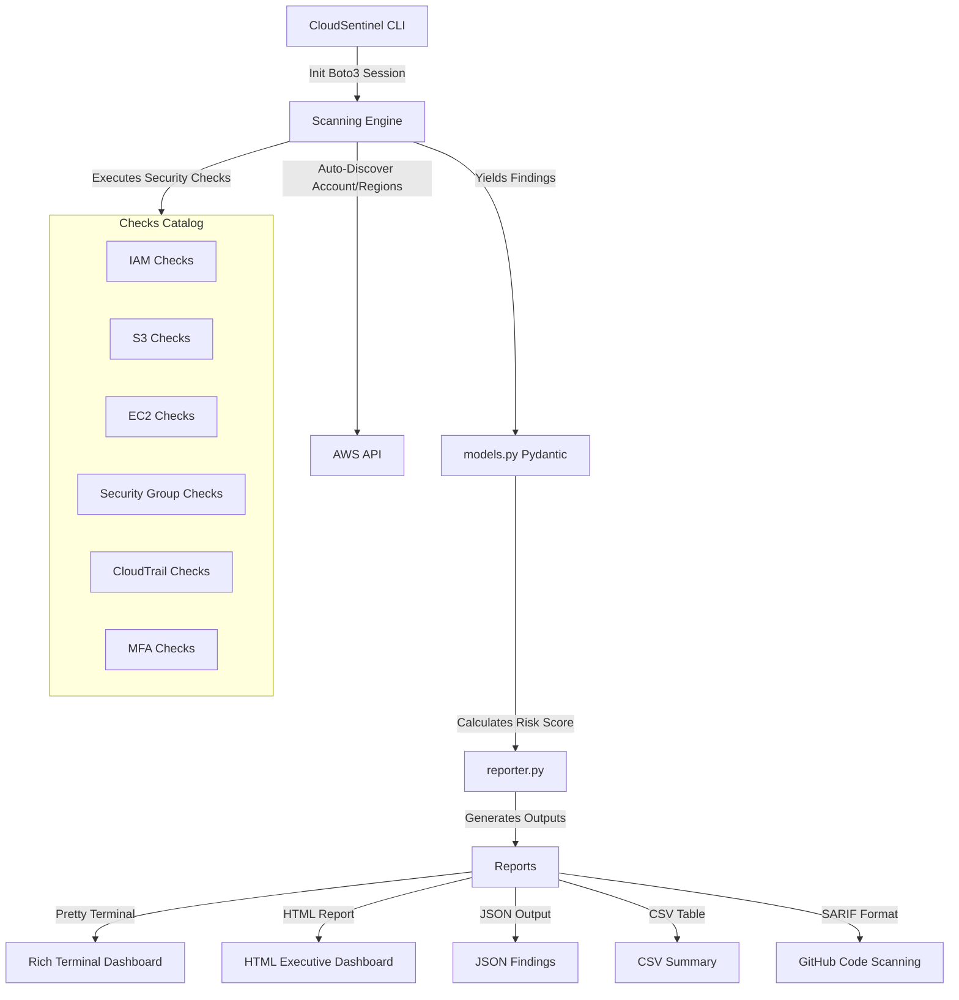

# CloudSentinel 🛡️

[](https://github.com/yourusername/CloudSentinel/actions/workflows/ci.yml)
[](https://opensource.org/licenses/MIT)
[](https://www.python.org/downloads/)
[](CONTRIBUTING.md)

**CloudSentinel** is a production-grade, open-source AWS Cloud Misconfiguration Scanner designed for cloud security engineers, auditors, DevSecOps teams, and students. It performs multi-region security scans across your AWS environment, identifies vulnerabilities, calculates category-specific and overall security scores, maps findings to **CIS AWS Foundations Benchmarks**, and outputs rich interactive terminal reports and exportable artifacts (HTML, JSON, CSV, SARIF).

---

## 🚀 Key Features

- **24 Built-in Security Checks** covering **IAM, S3, EC2, Network (Security Groups), CloudTrail, and MFA**.
- **CIS AWS Foundations Benchmark Mapping** for standard compliance auditing.
- **Dynamic Security Scoring** (0-100) based on severity risk weights:
  - `Critical` (15 pts), `High` (8 pts), `Medium` (4 pts), `Low` (1 pt), `Info` (0 pts).
- **Multi-Region Scanning**: Seamlessly queries all active or selected AWS regions.
- **Interactive Explainer CLI**: Use `cloudsentinel explain <check_id>` to view detailed descriptions, references, and AWS CLI/Console remediation commands.
- **Multiple Output Formats**: Export findings to **JSON**, professional **HTML Dashboard**, flat **CSV**, or **SARIF** (for Github Code Scanning integration).
- **Production-Grade Execution**: Handles AWS API throttling with automatic exponential backoff retry logic.

---

## 📐 Architecture Overview



---

## 📦 Installation

To install CloudSentinel from source:

1. Clone the repository:
   ```bash
   git clone https://github.com/yourusername/CloudSentinel.git
   cd CloudSentinel
   ```
2. Create and activate a virtual environment:
   ```bash
   python -m venv venv
   # On Windows:
   venv\Scripts\activate
   # On Unix/macOS:
   source venv/bin/activate
   ```
3. Install the application:
   ```bash
   pip install -e .
   ```

---

## 🛠️ Usage Examples

CloudSentinel relies on your local AWS credentials (`~/.aws/credentials` or environment variables like `AWS_ACCESS_KEY_ID`, `AWS_SECRET_ACCESS_KEY`).

### Run a basic scan on default region
```bash
cloudsentinel scan
```

### Scan using a specific AWS profile
```bash
cloudsentinel scan --profile production
```

### Scan specific regions
```bash
cloudsentinel scan --regions us-east-1,us-west-2
```

### Export reports in HTML and JSON to a directory
```bash
cloudsentinel scan --output reports/ --format html --format json
```

### Filter findings by severity
```bash
cloudsentinel scan --severity high
```

### Explain a security check finding & get remediation guidance
```bash
cloudsentinel explain S3-001
```

---

## 🗺️ Future Roadmap

- [ ] **Multi-account Scanning**: Support scanning multiple AWS Accounts inside AWS Organizations.
- [ ] **Full CIS AWS Foundations Benchmark Coverage** (v3.0.0).
- [ ] **Slack & Email Alerts** for automated alerts upon misconfigurations.
- [ ] **PDF Report Generation** with executive graphics.
- [ ] **AI-powered Remediation Assistant** generating custom Terraform/CloudFormation code to fix findings.

---

## 🤝 Contributing & Security

We welcome community feedback and contributions! Please refer to our [Contributing Guide](CONTRIBUTING.md) to set up your environment and submit pull requests.

If you find a security vulnerability, please follow the disclosure instructions in [SECURITY.md](SECURITY.md).
